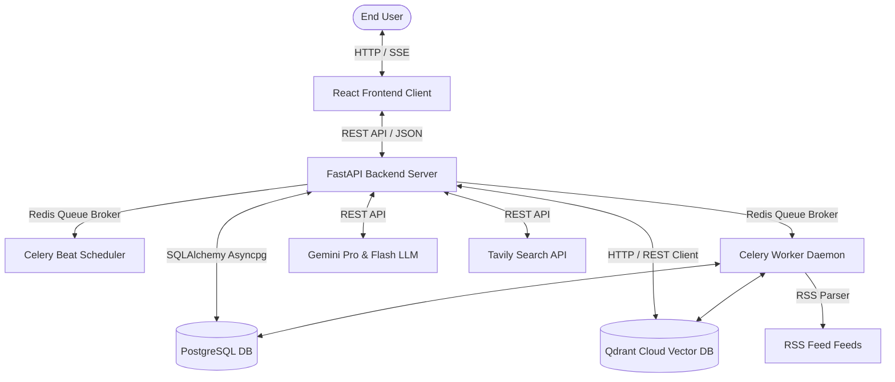

# Context Engine — AI-Powered News Analyst Bot

Context Engine is an advanced, production-grade agentic RAG application designed to deliver real-time news aggregation, semantic search, and contextual multi-turn conversational briefs. The platform implements an end-to-end RSS ingestion pipeline, custom vector search fusion, local Named Entity Recognition (NER), response caching, and a responsive frontend client.

---

## 1. Functional Requirements

### Ingestion & ETL Pipeline
1. **Multi-Source Fetching:** Ingests articles periodically from multiple RSS feeds (BBC, Al Jazeera, etc.) and extracts transcripts from YouTube links.
2. **Deduplication:** Enforces unique constraint rules on Postgres (`source_id`, `url`). Articles fetched across multiple categories link to existing database rows instead of duplicating.
3. **Local NER & Canonicalization:** Processes article text locally via spaCy (`en_core_web_sm`) to extract named entities (People, Locations, Organizations). Entities are canonicalized (merged if vector similarity $\ge 0.85$ in Qdrant `trending_entities`) and saved.
4. **Ingest Metrics Dashboard:** Exposes duration stats, parsing errors, deduplication rates, and point counts on an admin dashboard.

### Search & Conversational RAG
1. **Hybrid Retrieval:** Blends PostgreSQL BM25 lexical search and Qdrant Cloud dense vector search (using `text-embedding-004`), fused via Reciprocal Rank Fusion (RRF).
2. **Cross-Encoder Reranking:** Reranks fused search candidates using a Hugging Face Cross-Encoder model (`cross-encoder/ms-marco-MiniLM-L-6-v2`) to compute high-fidelity relevance scores.
3. **Relevance Score Floor:** Filters low-relevance results using a configurable rerank score threshold (`relevance_score_floor`).
4. **Query Rewriting:** Rewrites queries in multi-turn sessions to resolve phrasing, resolve typos, and anchor active conversation topics.
5. **Real-Time Web Fallback:** Automatically queries Tavily search to fetch live web news when local database coverage is empty or low.
6. **Multi-Turn Citation Recovery:** Scans generated answers for citation indexes (e.g. `[3]`) and dynamically recovers cited sources from database chat history log tables if they are absent from the current turn's retrieval hits.
7. **Response Caching:** Caches streaming and non-streaming RAG responses for 15 minutes. Cache hits trigger Celery tasks to update trending query metrics asynchronously.

### User Watch Alerts & Digests
1. **Personalized Daily Digests:** Automatically synthesizes daily brief digests matching topics of interest configured in user profiles.
2. **Significant Watches:** Scans new articles against watch keywords and triggers a Gemini LLM call to verify if matched events represent a "significant development" before creating user alerts.

---

## 2. Non-Functional Requirements (NFRs)

- **Performance & Latency:**
  - Raw searches resolve in under 50ms.
  - RAG classifications, hybrid fusion, and reranking execute in under 300ms (excluding LLM stream token generation time).
- **Scalability & Resource Isolation:**
  - CPU-bound tasks (local spaCy NER) and database count increments are fully delegated to background Celery workers.
  - Ingestion processes operate as non-blocking background workers, isolating the FastAPI ASGI server threads to handle web requests.
- **Security & JWT Separation:**
  - Separate authentication tables and JWT tokens for `admins` and `users`.
  - Cron tasks (Cloud Scheduler or local scheduler) run via secure `X-Admin-Api-Key` headers.
- **Robustness:**
  - Dynamic `rediss://` query parameter injector to automatically enable SSL/TLS validation bypass (`ssl_cert_reqs=CERT_NONE`) for serverless Redis brokers (e.g., Upstash).
  - Auto-ensured payload keyword indexes for `article_id` on Qdrant Cloud point collections to avoid bad request errors during scroll queries.

---

## 3. System High-Level Design (HLD)

The application follows a decoupled client-server architecture. All relational state resides in PostgreSQL, vector coordinates map to Qdrant Cloud, and asynchronous task states are coordinated through Redis.



### Core Architecture Components
1. **Frontend App (React + TypeScript):** Compiled via Vite. Renders chat streams, manages recording buffers, renders daily digests, watch alerts, and displays ETL observability logs.
2. **API Server (FastAPI):** Async server exposing routers for public search, chat session histories, digests, watches, and admin dashboards.
3. **Database (PostgreSQL):** Stores users, admin credentials, RSS configurations, categories, messages, and hourly/canonicalized trending stats.
4. **Vector DB (Qdrant Cloud):** Houses dense embeddings in two collections:
   - `news_chunks`: Text vectors for hybrid search.
   - `trending_entities`: Dense vector representations of canonicalized entities.
5. **Message Broker (Redis):** Orchestrates task state queues and hosts RAG response cache stores.
6. **Task Scheduler (Celery worker + Beat):** Periodically runs RSS crawlers and retention tasks in the background.

---

## 4. System Low-Level Design (LLD)

### Ingestion Flow & Deduplication
```
  [ Celery Beat / Trigger ]
              │
              ▼
    [ Fetch RSS Feed XML ]
              │
              ▼
    [ Deduplicate URL in DB ] ──(Exists?)──► [ Link to Categories in Junction Table ]
              │                                                │
          (New URL)                                            ▼
              │                                             [ Skip ]
              ▼
    [ Clean & Chunk Article ]
              │
              ▼
     [ Vectorize Chunk ] ──► [ Upsert points in Qdrant 'news_chunks' ]
              │
              ▼
   [ Extract Entities (spaCy) ]
              │
              ▼
  [ Canonicalize in Qdrant ] ──► [ Save Entity and Increment Ingestion Counts in DB ]
```

### RAG Retrieval & Answer Synthesis
```
        [ User Query ]
              │
              ▼
    [ Intent Classification ]
              │
              ▼
     [ Query Rewriter ]
              │
              ▼
      [ Hybrid Search ] ──► [ RRF Fusion ] ──► [ Reranking & Relevance Floor ]
                                                            │
                                                     (Hits Empty?)
                                                      /        \
                                                   (Yes)       (No)
                                                   /              \
                                     [ Tavily Web Search ]      [ Prompt builder ]
                                                   \              /
                                                    ▼            ▼
                                              [ LLM Stream Generation ]
                                                         │
                                                         ▼
                                             [ SSE final_sources Event ]
                                                         │
                                                         ▼
                                            [ Citation Recovery Resolver ]
```

---

## 5. Setup & Running Locally

### Prerequisites
- **Python 3.12+**
- **Node.js 18+**
- **Docker**

### 1. Database & Cache Startup
Start Postgres, Redis, and Qdrant containers:
```bash
docker-compose up -d
```

### 2. Backend Setup
1. Change directory to the backend repository:
   ```bash
   cd context-agent-backend
   ```
2. Copy `.env.example` to `.env` and fill in your connection credentials and API keys:
   ```bash
   cp .env.example .env
   ```
3. Install dependencies and download the spaCy English NLP pipeline:
   ```bash
   pip install -r requirements.txt
   python -m spacy download en_core_web_sm
   ```
4. Run database schema migrations:
   ```bash
   alembic upgrade head
   ```
5. Start the FastAPI ASGI server:
   ```bash
   python -m uvicorn app.main:app --port 8000 --reload
   ```
6. Start the Celery Worker and Beat Scheduler (in separate terminals):
   - **Worker:**
     ```bash
     celery -A app.worker.celery_app.celery_app worker --loglevel=info -P solo
     ```
   - **Beat Scheduler:**
     ```bash
     celery -A app.worker.celery_app.celery_app beat --loglevel=info
     ```

### 3. Frontend Setup
1. Change directory to the frontend client folder:
   ```bash
   cd ../context-agent-frontend
   ```
2. Copy `.env.example` to `.env` and define the backend API URL:
   ```bash
   cp .env.example .env
   ```
3. Install dependencies:
   ```bash
   npm install
   ```
4. Start the Vite dev server:
   ```bash
   npm run dev
   ```
   Open `http://localhost:5173` in your browser.

---

## 6. Complete Postman API Collection

Import the JSON schema below directly into Postman to test all system endpoints.

```json
{
  "info": {
    "name": "News Context Agent API",
    "schema": "https://schema.getpostman.com/json/collection/v2.1.0/collection.json"
  },
  "item": [
    {
      "name": "Public Endpoints",
      "item": [
        {
          "name": "Health Status",
          "request": {
            "method": "GET",
            "url": "http://localhost:8000/health"
          }
        },
        {
          "name": "Hybrid Search",
          "request": {
            "method": "GET",
            "url": {
              "raw": "http://localhost:8000/search/hybrid?q=ukraine war&limit=3",
              "protocol": "http",
              "host": ["localhost"],
              "port": "8000",
              "path": ["search", "hybrid"],
              "query": [
                { "key": "q", "value": "ukraine war" },
                { "key": "limit", "value": "3" }
              ]
            }
          }
        },
        {
          "name": "Direct Agent Query (No Session)",
          "request": {
            "method": "POST",
            "header": [
              { "key": "Content-Type", "value": "application/json" }
            ],
            "body": {
              "mode": "raw",
              "raw": "{\n  \"query\": \"What is happening in Ukraine?\",\n  \"limit\": 6,\n  \"history\": []\n}"
            },
            "url": "http://localhost:8000/agent/query"
          }
        }
      ]
    },
    {
      "name": "User Chat Endpoints",
      "item": [
        {
          "name": "User Registration",
          "request": {
            "method": "POST",
            "header": [
              { "key": "Content-Type", "value": "application/json" }
            ],
            "body": {
              "mode": "raw",
              "raw": "{\n  \"email\": \"user@contextagent.local\",\n  \"password\": \"securepassword123\"\n}"
            },
            "url": "http://localhost:8000/auth/register"
          }
        },
        {
          "name": "User Login",
          "request": {
            "method": "POST",
            "header": [
              { "key": "Content-Type", "value": "application/json" }
            ],
            "body": {
              "mode": "raw",
              "raw": "{\n  \"email\": \"user@contextagent.local\",\n  \"password\": \"securepassword123\"\n}"
            },
            "url": "http://localhost:8000/auth/login"
          }
        },
        {
          "name": "List Chat Sessions",
          "request": {
            "method": "GET",
            "header": [
              { "key": "Authorization", "value": "Bearer {{jwt_token}}" }
            ],
            "url": "http://localhost:8000/chat/sessions"
          }
        },
        {
          "name": "Create Chat Session",
          "request": {
            "method": "POST",
            "header": [
              { "key": "Authorization", "value": "Bearer {{jwt_token}}" },
              { "key": "Content-Type", "value": "application/json" }
            ],
            "body": {
              "mode": "raw",
              "raw": "{\n  \"title\": \"Ukraine conflict analysis\"\n}"
            },
            "url": "http://localhost:8000/chat/sessions"
          }
        },
        {
          "name": "Send Message",
          "request": {
            "method": "POST",
            "header": [
              { "key": "Authorization", "value": "Bearer {{jwt_token}}" },
              { "key": "Content-Type", "value": "application/json" }
            ],
            "body": {
              "mode": "raw",
              "raw": "{\n  \"query\": \"Why did Ukraine target Russian oil refineries?\",\n  \"limit\": 6\n}"
            },
            "url": "http://localhost:8000/chat/sessions/{{session_id}}/messages"
          }
        }
      ]
    },
    {
      "name": "Trending Endpoints",
      "item": [
        {
          "name": "Get Trending List",
          "request": {
            "method": "GET",
            "url": "http://localhost:8000/trending?limit=15"
          }
        },
        {
          "name": "Get Backing Coverage for Trending Entity",
          "request": {
            "method": "GET",
            "url": "http://localhost:8000/trending/entities/{{entity_id}}/articles"
          }
        }
      ]
    },
    {
      "name": "Admin Management Endpoints",
      "item": [
        {
          "name": "Admin Login",
          "request": {
            "method": "POST",
            "header": [
              { "key": "Content-Type", "value": "application/json" }
            ],
            "body": {
              "mode": "raw",
              "raw": "{\n  \"email\": \"admin@contextagent.local\",\n  \"password\": \"your-strong-password\"\n}"
            },
            "url": "http://localhost:8000/admin/login"
          }
        },
        {
          "name": "Force Ingest All Feeds",
          "request": {
            "method": "POST",
            "header": [
              { "key": "X-Admin-Api-Key", "value": "{{admin_api_key}}" }
            ],
            "url": "http://localhost:8000/admin/ingest/run"
          }
        },
        {
          "name": "Cleanup Old Articles (Retention)",
          "request": {
            "method": "POST",
            "header": [
              { "key": "X-Admin-Api-Key", "value": "{{admin_api_key}}" }
            ],
            "url": "http://localhost:8000/admin/maintenance/cleanup"
          }
        }
      ]
    }
  ]
}
```
